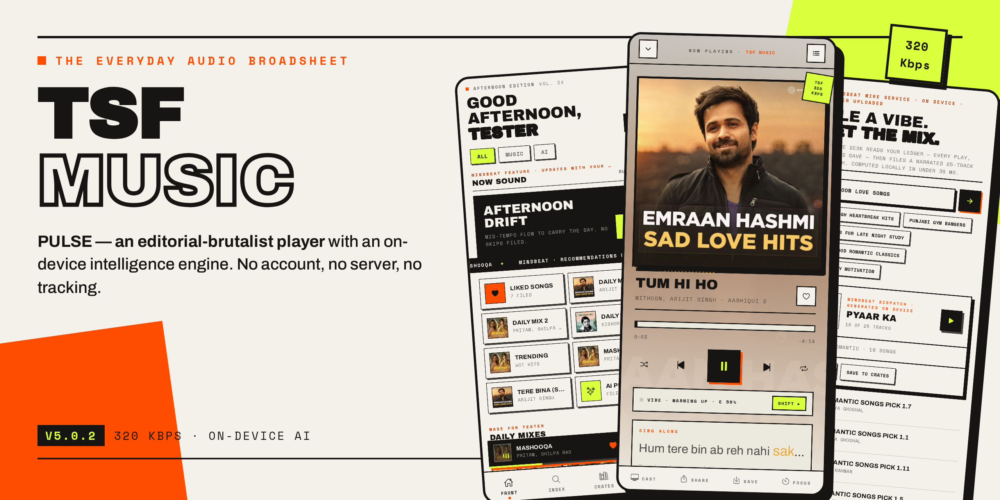
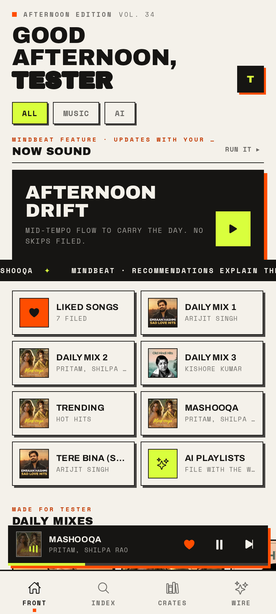
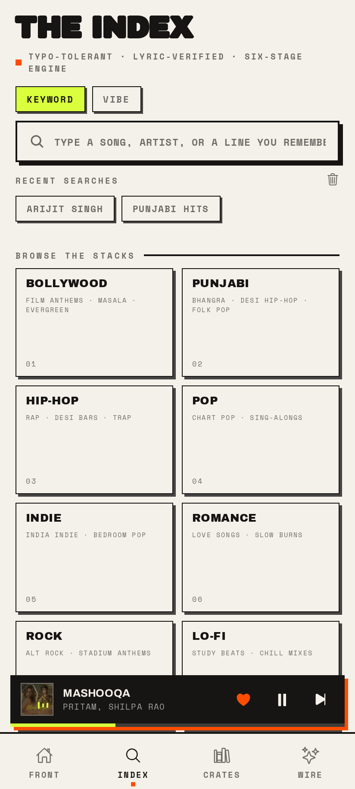
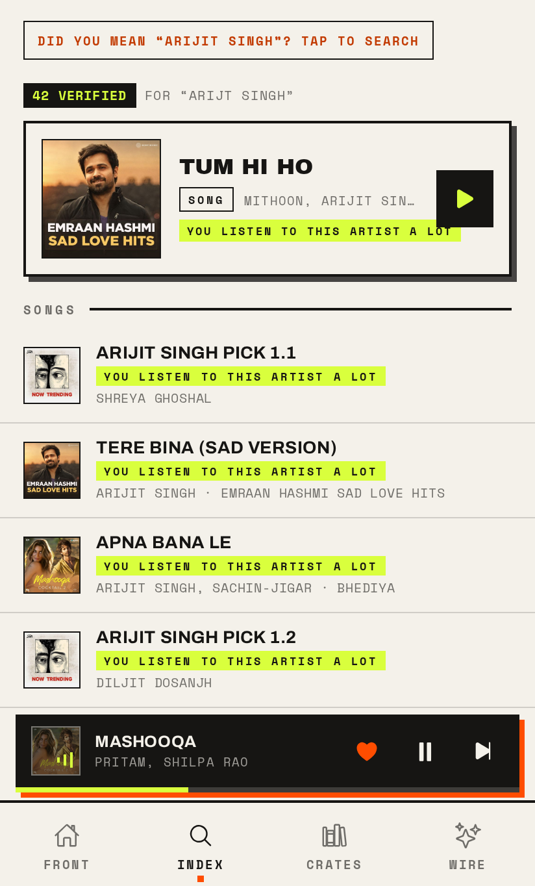
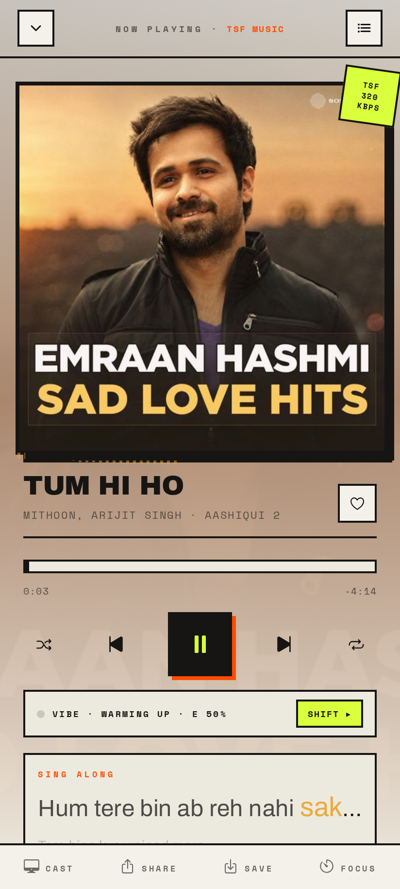
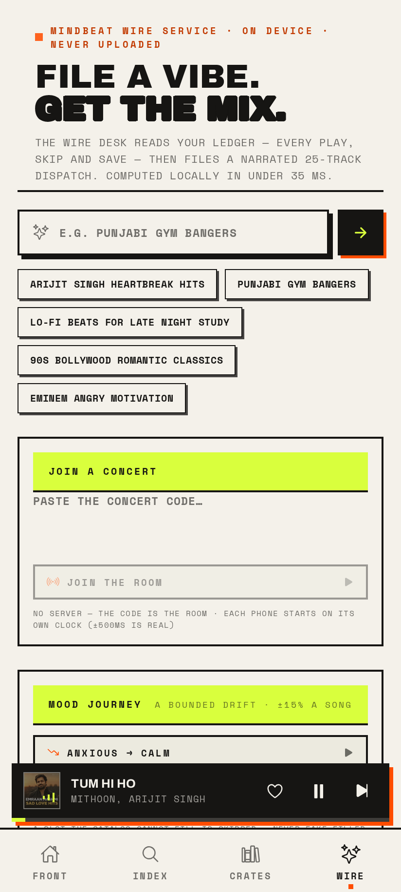
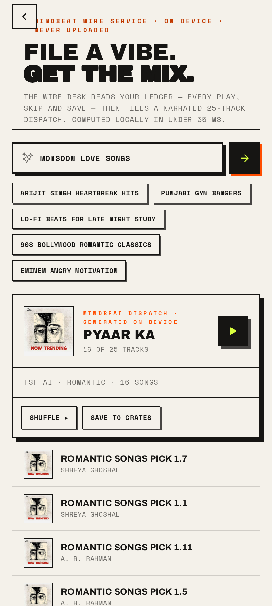
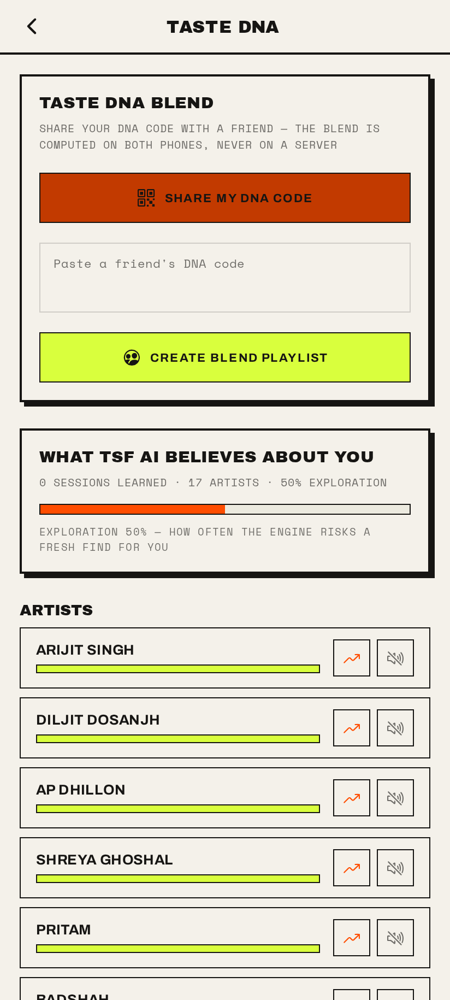
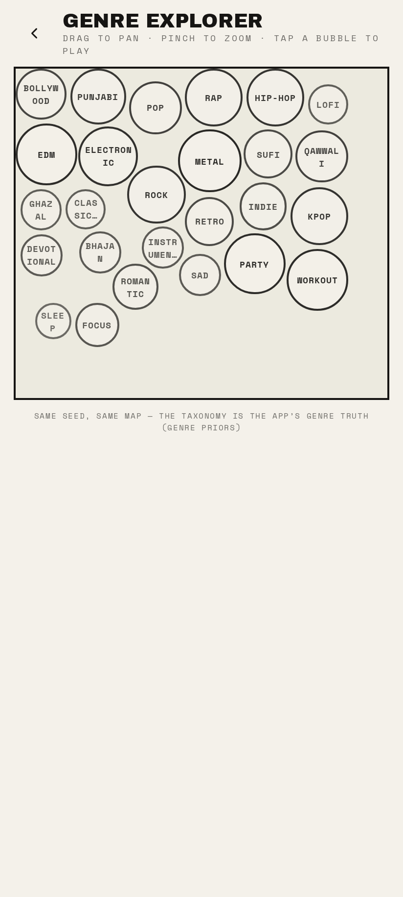

<div align="center">



# TSF Music

**A complete music platform, redrawn as an editorial broadsheet — PULSE — with a learning intelligence engine that runs entirely on your phone.**

No server · No account · No tracking · Install and it works

[](https://github.com/mua47105-hue/TSF-MUSIC/releases)
[](https://github.com/mua47105-hue/TSF-MUSIC/actions/workflows/native-android.yml)
[](#quality-assurance)
[](#build--run)
[](#privacy--content-safety)

[The experience](#the-experience) · [MINDBEAT AI](#mindbeat--the-on-device-intelligence) · [Architecture](#architecture) · [Build & run](#build--run) · [Quality assurance](#quality-assurance) · [Documentation](#documentation) · [Releases](#release-history)

</div>

---

TSF Music is a **standalone music platform** that aggregates public music
catalogs directly from your device — stream URLs are resolved, verified and
decrypted **on the phone**, at up to **320 kbps AAC**, with full-length,
ad-free playback. One engine merges every source into a single honest list:
one row per recording, truthful reason lines on every result, and a rescue
ladder that finds *the song you meant* even when the primary catalog lost it.

Everything is wrapped in **PULSE**: an editorial-brutalist interface of paper,
ink and acid that treats the app like a daily broadsheet — mastheads, kickers,
tickers, index numbers, hard offset shadows, zero rounded corners. Every play,
skip, like and download becomes graded evidence for **MINDBEAT**, an on-device
learning engine that builds radio stations, daily mixes, and recommendations
that actually explain themselves.

There is no backend anywhere in this system. No sign-up, no telemetry, no
LLM APIs — your listening history never leaves the device. The app calls the
music APIs directly from the phone, and every intelligence feature is computed
locally in under 35 ms.

---

## The experience

<table>
<tr>
<td align="center"></td>
<td align="center"></td>
<td align="center"></td>
<td align="center"></td>
</tr>
<tr>
<td align="center"><sub><b>Front</b> — the editorial broadsheet</sub></td>
<td align="center"><sub><b>Index</b> — browse the stacks</sub></td>
<td align="center"><sub><b>Search</b> — ranked & verified</sub></td>
<td align="center"><sub><b>Player</b> — artwork-tinted</sub></td>
</tr>
</table>

<table>
<tr>
<td align="center"></td>
<td align="center"></td>
<td align="center"></td>
<td align="center"></td>
</tr>
<tr>
<td align="center"><sub><b>Wire</b> — file a vibe, get the mix</sub></td>
<td align="center"><sub><b>AI playlists</b> — generated on device</sub></td>
<td align="center"><sub><b>Taste DNA</b> — the model, exposed</sub></td>
<td align="center"><sub><b>Genre Map</b> — pan, zoom, play</sub></td>
</tr>
</table>

<div align="center"><sub>Full walkthrough gallery: <a href="download/tsf-ui-screenshots/UI-Gallery.html">UI-Gallery.html</a> — every screen, two devices, automated capture, zero console errors</sub></div>

### Many catalogs, one app

TSF Music runs a **multi-source aggregation engine** instead of a single
provider pipe:

| Layer | What it does |
|---|---|
| **Primary catalog** | The full daily engine — editorial home feed, charts, artists, albums, playlists, full-length playback up to 320 kbps AAC, resolved and decrypted on-device |
| **Supplemental sources** | Long-tail depth and full-length rescue for songs the primary catalog dropped; strict kill-switch isolation means supplemental breakage can *never* degrade the core |
| **Preview fallback** | 30-second iTunes previews top up any thin result set, honestly badged — you always get results, even mid-outage |

Sources are never shown as a science project: rows from every source carry
honest labels (*full song* / *30 s preview*), mix freely in one queue, and
pass the same verification, dedup and safety gates.

### Search that finds the song you meant

Search isn't a text field — it's a six-stage engine
([S0 classifier → S5 learning](docs/ARCHITECTURE.md)):

- **Typos and Hinglish fixed automatically** — "arjit sing" → Arijit Singh,
  "kun fya kun" → Kun Faya Kun (SymSpell, ≤2 edits)
- **One row per song** — 26 duplicate "Tum Hi Ho" releases collapse to one;
  re-credited and re-ordered re-listings reconcile to a single recording
- **The rescue ladder** — when the catalog only has covers of the song you
  typed ("tu chaiye" → 31 covers, zero originals), the engine escalates
  supplemental sources → iTunes → variant spellings → album routes and paints
  the *verified canonical recording at rank 1* with an honest label of
  exactly what you're getting
- **Lyric search** — type a remembered line; matches carry a green
  *Lyric match* chip with the matched line, verified against LRCLIB
- **Truthful reason lines, always** — every row explains itself from a
  closed code set: *Best match for your search · Matches the lyric you
  typed · You chose this for this search before*. A fabricated result
  state is a test-locked bug class
- **Deep results** — pages keep appending as you scroll (39–40 verified
  rows per query), with honest end markers, never a dead spinner

### The player

- 320 kbps playback with background audio, notification & lock-screen controls
- **Stale-URL auto-recovery** — expired CDN links silently refetch and
  re-decrypt mid-session
- Real queue control: play next, add/remove from queue, shuffle, repeat,
  Smart Shuffle & Autoplay toggles in the queue sheet
- **Offline downloads** — resolved streams saved to app-private storage,
  playable forever
- The app **repaints itself per song**: artwork colors are extracted in
  pure JS and drive the player gradient and every collection header

## MINDBEAT — the on-device intelligence

Every interaction becomes graded evidence in a local ledger. Six layers —
ledger → taste profile → session brain → decision engine → surfaces →
trust — turn that into:

| Surface | What it does |
|---|---|
| **Smart Shuffle v2** | AI picks interleaved into your queue, vibe-locked to the session; skipping a rec re-seeds the next one away from what you rejected |
| **Autoplay Radio v2** | Queue never dies — a multi-seed station keeps playing even with the UI killed |
| **Daily Mixes v2** | Artist-cluster × mood-cell crosses, 60/25/15 core/bridge/fresh, re-ranked nightly |
| **Now Sound (daylist)** | Time-aware: your 11 pm and 11 am get different names and tracks |
| **On the Rise** | Seed-of-seed discovery, each row with its honest "via artist" chain |
| **AI Playlists** | Type a vibe — "Punjabi gym bangers", Hinglish works — get a narrated 25-track playlist |
| **Vibe Search** | The search bar's NLP mode: "songs like kun faya kun", typo-tolerant |
| **Your Sound v2** | Wrapped-grade stats with the industry 30-second rule |
| **Taste DNA** | The full model, exposed: affinities, daypart matrix, corrections, JSON export, kill switch |

Full design: [docs/MINDBEAT.md](docs/MINDBEAT.md) · decision engine p95: **~4 ms**
(budget: 150 ms) · blind A/B preferred over the legacy engine 17/20.

### Design — PULSE (v4.0)

- Editorial brutalism: warm paper `#F4F1EA`, ink `#161513`, acid `#D9FF3D`,
  safety-orange `#FF4D00` — type is the interface, zero radius in the chrome,
  hard offset shadows instead of blurs
- Archivo Black display type + Archivo text + Space Mono labels (7 weights),
  outline-stroke mastheads, marquee ticker, stamped 320 kbps artwork
- The artwork palette engine stays: every player surface carries a whisper
  of the current song's extracted hue over the paper wash
- **Tablet & foldable correct** — fully resizeable windows, live
  re-measuring layout, no letterboxing, verified at 5 viewports
  (Pixel 7, iPhone 13, portrait + landscape tablet, desktop window)
- First-run onboarding with real artist photography (48 verified A-lister
  seeds + 8 live categories), permanent completion (dual-write, crash-safe)
- "What's new" dialog + on-screen version badge on every release — updates
  are visibly verifiable on the device

### Privacy & content safety

- The ledger stores **no URLs, device ids or identifiers** (verifier-tested)
- Everything lives in app-private storage; nothing is uploaded anywhere
- The only third-party call beyond the music catalogs: LRCLIB (public lyrics
  catalog) for lyric-search resolution — title + artist only
- Kill switch disables all recommendations; export or reset the model any
  time from Taste DNA
- Explicit/abusive content never reaches Home or any algorithmic surface
  (provider flags + EN/Hindi/Punjabi blocklist, dodge-corpus tested);
  search honors intent and shows an "E" badge instead

## At a glance

| | |
|---|---|
| Latest release | **v5.0.2** (THE STABILITY PATCH — the test-isolation bug that held v5.0.1 in CI red is closed: the B3 network mock is scoped to its own file, expo-network ships its webmock (house rule 15), and the README test-count badge tells the truth again; zero app-behavior change on top of v5.0.1's verification round. In-place upgrades, same keystore since v2.0) |
| Audio | Up to 320 kbps AAC, background service, lock-screen controls |
| Catalogs | Multi-source aggregation on-device — primary catalog + supplemental sources + iTunes preview fallback |
| Intelligence | 100% on-device, 6 layers, 9 surfaces, p95 ~4 ms decisions |
| QA | 885 replay tests · 4,293 assertions · tsc strict · 93-checkpoint device lab · post-ship APK binary verification |
| Delivery | GitHub Actions → signed APK → GitHub Release (~15 min per tag) |
| Size | ~83 MB APK, RN 0.76 + Expo 52, zero telemetry |

## Installation

1. Download `app-release.apk` from the
   [latest release](https://github.com/mua47105-hue/TSF-MUSIC/releases)
2. Open it on your Android phone and allow installs from your browser/files
   app (one-time)

That's it. All releases are signed with the same keystore, so every update
installs in place over the previous version — playlists, downloads and
stats are preserved.

## Architecture

```
┌─────────────────────────────────────────────────────────────────┐
│  UI        10 screens · PULSE broadsheet · dynamic palette      │
│            (artwork color extraction in pure JS)                │
├─────────────────────────────────────────────────────────────────┤
│  SEARCH    S0 plan → S1 fan-out → S2 verify → S3 rank →         │
│  V2        S4 recover → S5 learn (typo-tolerant, Hinglish,      │
│            rescue ladder, lyric verification)                   │
├─────────────────────────────────────────────────────────────────┤
│  MINDBEAT  ledger → profile → session → decisions → surfaces    │
│  (src/ai)  single facade, SQLite WAL store, 6 layers            │
├─────────────────────────────────────────────────────────────────┤
│  SOURCES   catalog adapters (primary + supplemental) ·          │
│            on-device stream resolution & decryption ·           │
│            artists · lyrics · previews · recording dedup        │
├─────────────────────────────────────────────────────────────────┤
│  PLAYBACK  react-native-track-player · background service ·     │
│            stale-URL recovery · offline downloads               │
├─────────────────────────────────────────────────────────────────┤
│  DEVICE    no servers, no accounts — the phone is the client   │
└─────────────────────────────────────────────────────────────────┘
```

Full module map, data flow and contracts: **[docs/ARCHITECTURE.md](docs/ARCHITECTURE.md)**

## Build & run

```bash
bun install
bun run typecheck        # tsc --noEmit (strict) — must be clean
bun test                 # 885 replay tests incl. latency budgets
bunx expo start          # Metro dev server
bunx expo run:android    # native debug build
```

### Release pipeline (CI/CD)

Every push to `main` runs the full test + typecheck gate, then builds a
**signed release APK** via GitHub Actions (monotonic versionCode, keystore
from secrets). Pushing a `v*` tag publishes a GitHub Release:

```bash
git tag v5.0.3 && git push origin v5.0.3   # → signed release APK in ~15 min
```

After every release, the **shipped APK itself** is deep-verified — manifest
version probe, exact markers for every feature read from the **parsed
Hermes string table** (raw substring greps false-positive across the
packed string storage), webmock-leak check (`scripts/verify_v43_apk.py`
is the current template; all green on v4.3.0, 25 discriminating failures
on v4.1.0).

## Quality assurance

1. **885 replay tests** — engine behavior, latency budgets, gauntlet
   regression locks (every shipped bug class is locked red-on-old-code),
   plus the adversarial mutation harness (every fix in v5.0.1/v5.0.2 is
   mutation-proven RED; see the changelog)
2. **The device lab** — the real app on react-native-web with fixture
   data layers, driven by Playwright at hardware-faithful viewports:
   93 checkpoints × 3 devices, zero console errors
3. **The gauntlet loop** — every major feature ships only after a
   fresh-context adversarial critic fails it, every P0 is fixed with a
   regression lock, and blind A/B beats or matches the reference
4. **Post-ship binary verification** — the published APK is unpacked and
   inspected, not just the working tree

Methodology: [docs/DEVELOPMENT.md](docs/DEVELOPMENT.md)

## Documentation

| Doc | Contents |
|---|---|
| [ARCHITECTURE.md](docs/ARCHITECTURE.md) | Module map, data flow, playback pipeline, theming, persistence, CI topology |
| [MINDBEAT.md](docs/MINDBEAT.md) | The six-layer intelligence stack: surfaces, reason codes, tuning, privacy |
| [DEVELOPMENT.md](docs/DEVELOPMENT.md) | Setup, workflow, device lab, gauntlet methodology, release process, conventions |
| [CHANGELOG.md](docs/CHANGELOG.md) | Every release v1.0 → v5.0.2, root-caused and verified |
| [SEARCH-INTENT-RESCUE-PLAN.md](docs/SEARCH-INTENT-RESCUE-PLAN.md) | Engineering RFC: the specific-intent guarantee (shipped in v3.4.0) |
| [SUPPLEMENTAL-CATALOG-RFC.md](docs/SUPPLEMENTAL-CATALOG-RFC.md) | Engineering RFC: the supplemental catalog source design (shipped in v3.4.0) |
| [LAB-TESTING-GUIDE.md](docs/LAB-TESTING-GUIDE.md) | The staging-repo workflow that device-verified the v3.4.0 line |

## Release history

| Version | Headline |
|---|---|
| **v5.0.2** | **THE STABILITY PATCH** — the test-isolation ship-blocker closed (the B3 network-mock leak that held v5.0.1 in CI red), expo-network webmock parity (house rule 15), README test-count truth; zero app-behavior change, suite 885/0 |
| **v5.0.1** | **THE VERIFICATION ROUND** — the independent auditor's 2 P1 ship-blockers + 6 P2 broken promises fixed with mutation-proven locks: atomic Time-Machine folds (no more data loss on a failing write), the honest session-memory relabel (≤30% *freshly added*, not *unheard*), the vibe-shuffle bound enforced during the walk, real Concert-Mode size caps (no silent truncation, the 4:3 dead band closed), real network-kind artwork prewarm (expo-network) + queue-fingerprint invalidation, resolved-count playback toasts on five surfaces, clock-proof stories/bookmarks caps, haptic hydration gate, karaoke integer word-spans, negative art cache, and docs that match what shipped |
| **v5.0.0** | **THE MAGNUM OPUS** — 20 features in 5 gauntleted waves: Prewarm/Prefetch, Image Prewarm + Cinema Flight, Song Stories, Audio Bookmarks, Taste Radar, Time Machine, Haptic Choreography, Pseudo-Visualizer, Karaoke Words, Shuffle by Vibe, Mood Journey, Session Memory, Decade Radio, Artist Timeline, Concert Mode, Genre Explorer, Memory Tags |
| **v4.3.1** | Final paperwork — the auditor's 4 P1s squashed (behavioral safety locks, the volume-bus fix, blend determinism, the lost doc), the v4 line backfilled into the changelog, the v4.3 APK verifier, dead reason code removed |
| **v4.3.0** | **THE TEN** — Smart Volume · Crossfade + Playback Speed · Smart Crates · Edit Info · Local Rewind (monthly Wrapped) · Taste DNA Blend · Kinetic Lyrics · Aura Visualizer · Focus Mode — ten features, four waves, all on-device |
| **v4.2.0** | **GODMODE INTELLIGENCE** — the 6-phase "Lightweight Genius" lift: baked feature table (122k rows, offline), Thompson bandit + hard reject veto, directed Markov flow memory (FLOW_NEXT), lyric mood reading (VADER + romanized Hindi/Punjabi, ±0.25 bounded), tag-overlap sound-alike, dynamic mind-reading home feed, session-aligned search, cold-start artist seeding |
| **v4.1.0** | **THE GODMODE EDITION** — synced karaoke lyrics, instant tap, share card, weekly crate, sleep timer, data saver |
| **v4.0.0** | **PULSE** — the complete UI redesign: editorial brutalism, the Wire tab, broadsheet player, real synced lyrics, micro-interactions everywhere |
| **v3.4.5** | Field-fix round: real songs over lo-fi covers, 40-deep search results, zero Top Songs repeats, 60 fps home feed |
| **v3.4.4** | The half-screen window bug, closed at the root (invisible WebView wrapper) with 9 regression locks |
| **v3.4.3** | Full-bleed windows on every device: aspect-clamp immunity (4 compat opt-outs + maxAspectRatio) |
| **v3.4.0–.2** | Supplemental catalog source + the title-truth rescue ladder; orientation freedom; endless feeds |
| **v3.3.0** | Search V2 — the six-stage engine (classifier, SymSpell, verification, ranking, recovery, learning) |
| **v3.0–v3.2** | MINDBEAT intelligence stack; onboarding with real artist photos; deep editorial home |
| **v2.1–v2.5** | Spotify-grade UI system, dynamic theming, content safety, CI releases |
| **v2.0** | Standalone baseline: direct catalog APIs on-device, 320 kbps, offline downloads |

Full detail: [docs/CHANGELOG.md](docs/CHANGELOG.md)

## Stack

React Native 0.76 · Expo SDK 52 (prebuild, bare workflow) ·
react-native-track-player 4.1.1 · expo-sqlite (event ledger, WAL) ·
AsyncStorage · expo-linear-gradient / haptics / font / file-system ·
crypto-js (on-device stream decryption) · jpeg-js (artwork color
extraction) · Archivo Black / Archivo / Space Mono typography (PULSE) ·
TypeScript strict · Bun · GitHub Actions.

---

<div align="center">

**TSF Music** — big-platform experience, zero-platform dependency.

[Download the latest release](https://github.com/mua47105-hue/TSF-MUSIC/releases) · [Report an issue](https://github.com/mua47105-hue/TSF-MUSIC/issues)

</div>
