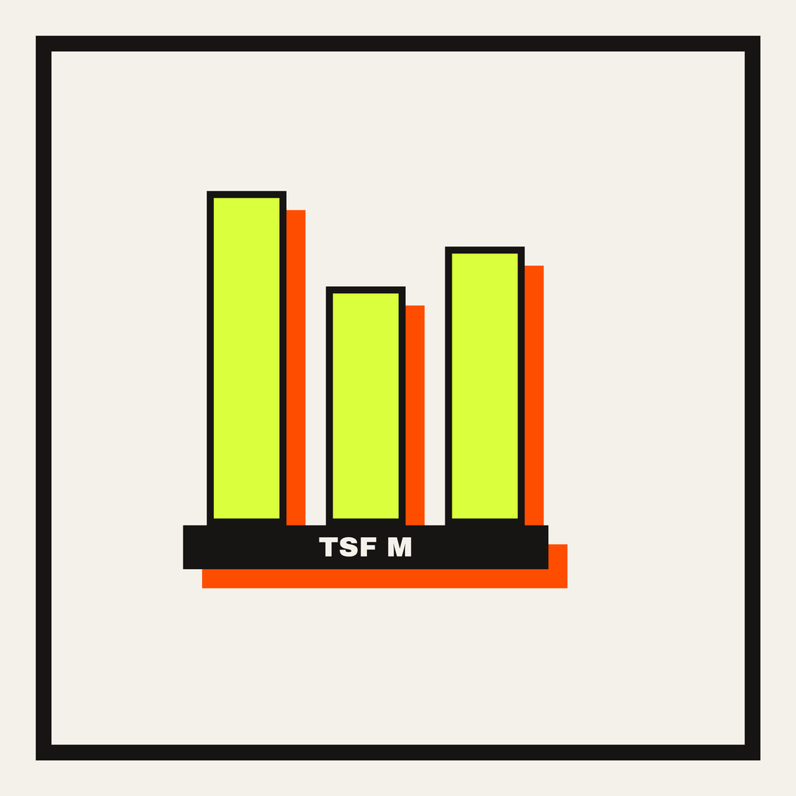
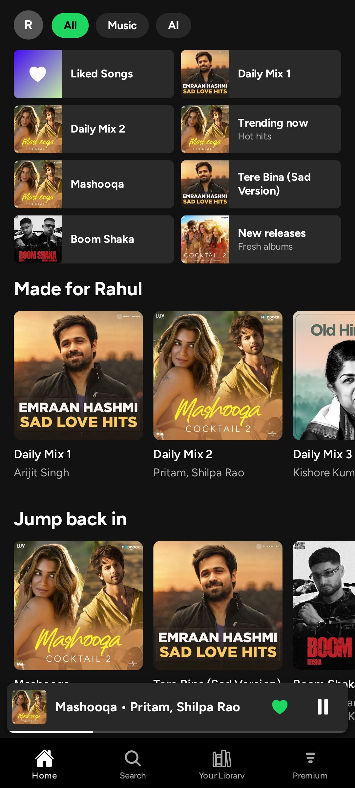
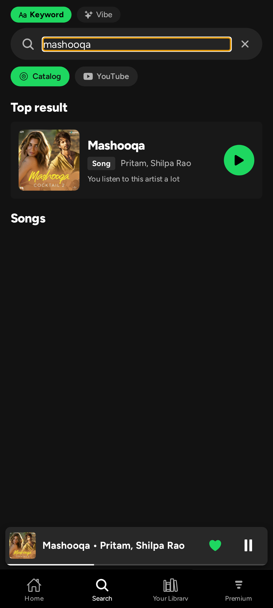
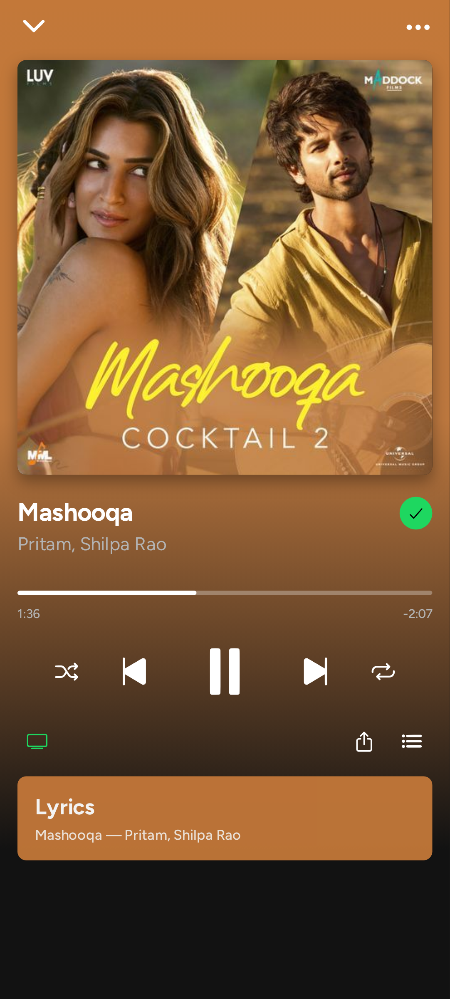
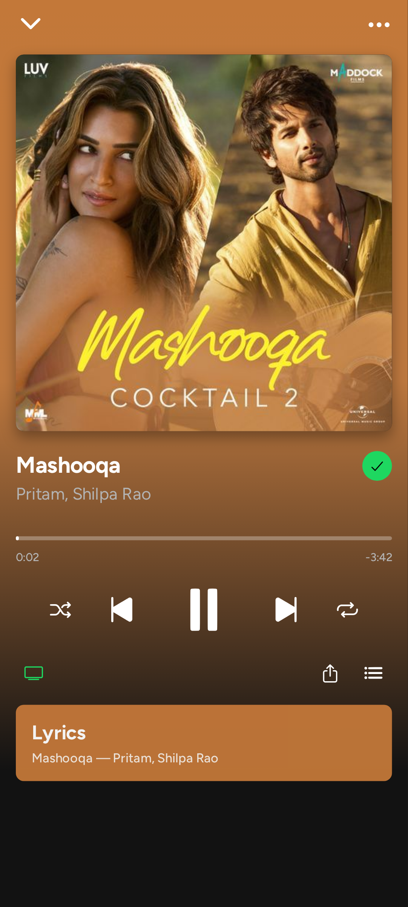
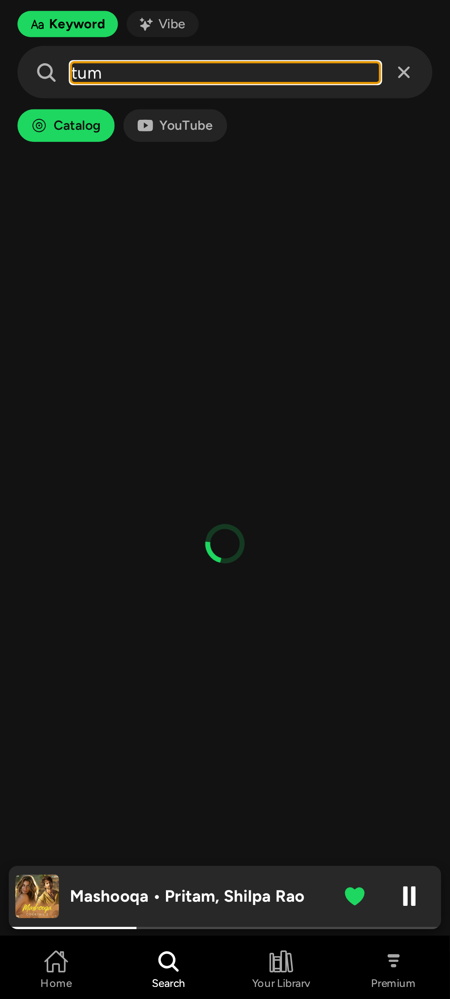
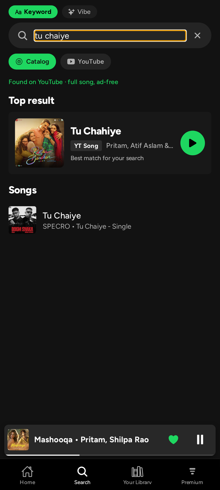
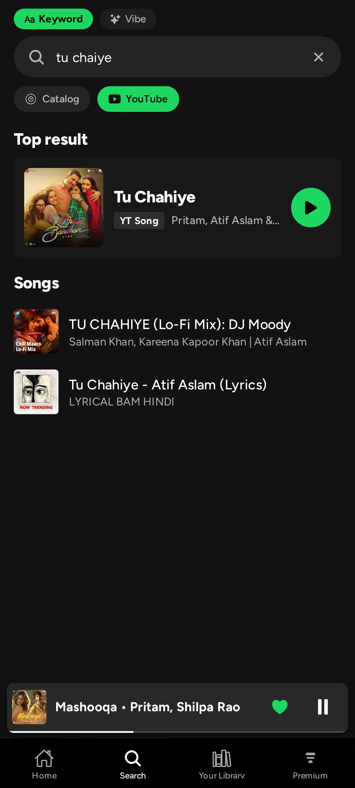
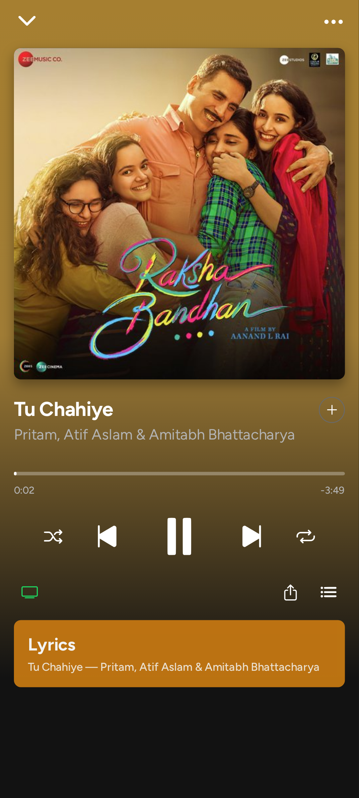

<div align="center">



# TSF Music

**A complete music platform, redrawn as an editorial broadsheet — PULSE — with a learning intelligence engine that runs entirely on your phone.**

No server · No account · No tracking · Install and it works

[](https://github.com/mua47105-hue/TSF-MUSIC/releases)
[](https://github.com/mua47105-hue/TSF-MUSIC/actions/workflows/native-android.yml)
[](#quality-assurance)
[](#build--run)
[](#privacy)

[Installation](#installation) · [Features](#the-experience) · [MINDBEAT AI](#mindbeat--the-on-device-intelligence) · [Architecture](#architecture) · [Documentation](#documentation) · [Releases](#release-history)

</div>

---

TSF Music streams **320 kbps audio** from two catalogs — JioSaavn's full library
(decrypted on-device) and **YouTube's music catalog with ad-free full-song
playback** — wrapped in **PULSE**: an editorial-brutalist interface of paper,
ink and acid that treats the app like a daily broadsheet (mastheads, kickers,
tickers, index numbers, hard shadows, zero rounded corners). Every play, skip,
like and download becomes graded evidence for **MINDBEAT**, an on-device
learning engine that builds radio stations, daily mixes, and recommendations
that actually explain themselves.

There is no backend anywhere in this system. No sign-up, no telemetry, no
LLM APIs — your listening history never leaves the device. The app calls the
music APIs directly from the phone, and every intelligence feature is computed
locally in under 35 ms.

---

## The experience

<table>
<tr>
<td align="center"></td>
<td align="center"></td>
<td align="center"></td>
<td align="center"></td>
</tr>
<tr>
<td align="center"><sub><b>Home</b> — deep editorial feed</sub></td>
<td align="center"><sub><b>Search</b> — ranked & verified</sub></td>
<td align="center"><sub><b>Player</b> — artwork-tinted</sub></td>
<td align="center"><sub><b>Mini player</b> — persistent</sub></td>
</tr>
</table>

<table>
<tr>
<td align="center"></td>
<td align="center"></td>
<td align="center"></td>
<td align="center"></td>
</tr>
<tr>
<td align="center"><sub><b>Typeahead</b> — suggests as you type</sub></td>
<td align="center"><sub><b>Rescue</b> — the song you *meant*</sub></td>
<td align="center"><sub><b>YouTube</b> — second catalog</sub></td>
<td align="center"><sub><b>Verified</b> — plays what it promised</sub></td>
</tr>
</table>

<div align="center"><sub>Full walkthrough gallery: <a href="download/tsf-ui-screenshots/UI-Gallery.html">UI-Gallery.html</a> (every screen, two devices, automated capture)</sub></div>

### Two catalogs, one app

| | JioSaavn (primary) | YouTube (secondary) |
|---|---|---|
| Depth | Full Indian + international catalog | Music catalog + official uploads |
| Quality | 320 kbps AAC (DES stream, decrypted on-device) | Best-available audio stream |
| Ads | None | **None** — direct audio stream extraction |
| Role | Home feed, charts, editorial, playback core | Catalog toggle, rescue provider, long-tail songs |

The YouTube source is a three-client InnerTube ladder — VISIONOS (tokenless)
→ WEB_REMIX (BotGuard-attested PO tokens minted in a hidden WebView) →
ANDROID_VR (last resort) — the same production technique used by NewPipe and
yt-dlp. A strict kill-switch discipline guarantees YouTube breakage can
**never** degrade the JioSaavn core: every entry point degrades to honest
empty states and per-rung diagnostics.

### Search that finds the song you meant

Search isn't a text field — it's a six-stage engine
([S0 classifier → S5 learning](docs/ARCHITECTURE.md)):

- **Typos and Hinglish fixed automatically** — "arjit sing" → Arijit Singh,
  "kun fya kun" → Kun Faya Kun (SymSpell, ≤2 edits)
- **One row per song** — 26 duplicate "Tum Hi Ho" releases collapse to one;
  re-credited and re-ordered re-listings reconcile to a single recording
- **The rescue ladder** — when the catalog only has covers of the song you
  typed ("tu chaiye" → 31 covers, zero originals), the engine escalates
  YouTube → iTunes → variant spellings → album routes and paints the
  *verified canonical recording at rank 1* with an honest label:
  *Found on YouTube · full song, ad-free*
- **Lyric search** — type a remembered line; matches carry a green
  *Lyric match* chip with the matched line, verified against LRCLIB
- **Truthful reason lines, always** — every row explains itself from a
  closed code set: *Best match for your search · Matches the lyric you
  typed · You chose this for this search before*. A fabricated result
  state is a test-locked bug class
- **Deep results** — pages keep appending as you scroll (39–40 verified
  rows per query), with honest end markers, never a dead spinner

### The player

- 320 kbps playback with background audio, notification & lock-screen controls
- **Stale-URL auto-recovery** — expired CDN links silently refetch and
  re-decrypt mid-session
- Real queue control: play next, add/remove from queue, shuffle, repeat,
  Smart Shuffle & Autoplay toggles in the queue sheet
- **Offline downloads** — resolved streams saved to app-private storage,
  playable forever
- The app **repaints itself per song**: artwork colors are extracted in
  pure JS and drive the player gradient and every collection header

## MINDBEAT — the on-device intelligence

Every interaction becomes graded evidence in a local ledger. Six layers —
ledger → taste profile → session brain → decision engine → surfaces →
trust — turn that into:

| Surface | What it does |
|---|---|
| **Smart Shuffle v2** | AI picks interleaved into your queue, vibe-locked to the session; skipping a rec re-seeds the next one away from what you rejected |
| **Autoplay Radio v2** | Queue never dies — a multi-seed station keeps playing even with the UI killed |
| **Daily Mixes v2** | Artist-cluster × mood-cell crosses, 60/25/15 core/bridge/fresh, re-ranked nightly |
| **Now Sound (daylist)** | Time-aware: your 11 pm and 11 am get different names and tracks |
| **On the Rise** | Seed-of-seed discovery, each row with its honest "via artist" chain |
| **AI Playlists** | Type a vibe — "Punjabi gym bangers", Hinglish works — get a narrated 25-track playlist |
| **Vibe Search** | The search bar's NLP mode: "songs like kun faya kun", typo-tolerant |
| **Your Sound v2** | Wrapped-grade stats with the industry 30-second rule |
| **Taste DNA** | The full model, exposed: affinities, daypart matrix, corrections, JSON export, kill switch |
| **The Baked Knowledge Table** | Real Spotify audio features (83k recordings, shipped in the APK) replace mood guesses with `source: 'dataset'` numbers |
| **Thompson Sampling Bandit** | Learns from every graded listen — repeated skips quietly sink a track, completions raise it (deterministic, seeded) |
| **Flow Memory** | Directional track→track transitions — radio follows the flow you actually play, "Keeps your flow going" |
| **Lyric Mood Reading** | VADER + a curated Hindi/Punjabi lexicon read lyric mood into valence (bounded, valence only) |
| **Sound Alike** | Tag-overlap cousins — genre/language/era/mood — with the honest "Close to …" reason |

Full design: [docs/MINDBEAT.md](docs/MINDBEAT.md) · decision engine p95: **~4 ms**
(budget: 150 ms) · blind A/B preferred over the legacy engine 17/20.

### Design — PULSE (v4.0)

- Editorial brutalism: warm paper `#F4F1EA`, ink `#161513`, acid `#D9FF3D`,
  safety-orange `#FF4D00` — type is the interface, zero radius in the chrome,
  hard offset shadows instead of blurs
- Archivo Black display type + Archivo text + Space Mono labels (7 weights),
  outline-stroke mastheads, marquee ticker, stamped 320 kbps artwork
- The artwork palette engine stays: every player surface carries a whisper
  of the current song's extracted hue over the paper wash
- **Tablet & foldable correct** — fully resizeable windows, live
  re-measuring layout, no letterboxing, verified at 5 viewports
  (Pixel 7, iPhone 13, portrait + landscape tablet, desktop window)
- First-run onboarding with real artist photography (48 verified A-lister
  seeds + 8 live categories), permanent completion (dual-write, crash-safe)
- "What's new" dialog + on-screen version badge on every release — updates
  are visibly verifiable on the device

### Privacy & content safety

- The ledger stores **no URLs, device ids or identifiers** (verifier-tested)
- Everything lives in app-private storage; nothing is uploaded anywhere
- The only third-party call beyond the music APIs: LRCLIB (public lyrics
  catalog) for lyric-search resolution — title + artist only
- Kill switch disables all recommendations; export or reset the model any
  time from Taste DNA
- Explicit/abusive content never reaches Home or any algorithmic surface
  (provider flags + EN/Hindi/Punjabi blocklist, dodge-corpus tested);
  search honors intent and shows an "E" badge instead

## At a glance

| | |
|---|---|
| Latest release | **v4.1.0 — THE GODMODE EDITION** (sing-along lyrics, instant tap, share card, weekly crate, baked knowledge table) |
| Audio | 320 kbps AAC, background service, lock-screen controls |
| Catalogs | JioSaavn (full) + YouTube (music, ad-free) + iTunes preview fallback |
| Intelligence | 100% on-device, 6 layers + baked knowledge table, p95 ~4 ms decisions |
| QA | 421 replay tests · 2,200+ assertions · tsc strict · 93-checkpoint device lab · post-ship APK binary verification |
| Delivery | GitHub Actions → signed APK → GitHub Release (~15 min per tag) |
| Size | ~79 MB APK, RN 0.76 + Expo 52, zero telemetry |

## Installation

1. Download `app-release.apk` from the
   [latest release](https://github.com/mua47105-hue/TSF-MUSIC/releases)
2. Open it on your Android phone and allow installs from your browser/files
   app (one-time)

That's it. All releases are signed with the same keystore, so every update
installs in place over the previous version — playlists, downloads and
stats are preserved.

## Architecture

```
┌─────────────────────────────────────────────────────────────────┐
│  UI        10 screens · Spotify-faithful · dynamic palette      │
│            (artwork color extraction in pure JS)                │
├─────────────────────────────────────────────────────────────────┤
│  SEARCH    S0 plan → S1 fan-out → S2 verify → S3 rank →        │
│  V2        S4 recover → S5 learn (typo-tolerant, Hinglish,      │
│            rescue ladder, lyric verification)                   │
├─────────────────────────────────────────────────────────────────┤
│  MINDBEAT  ledger → profile → session → decisions → surfaces   │
│  (src/ai)  single facade, SQLite WAL store, 6 layers            │
├─────────────────────────────────────────────────────────────────┤
│  SOURCES   saavn.ts (DES decrypt) · youtube.ts (InnerTube      │
│            3-client ladder + PO-token bridge) · artists.ts ·   │
│            lrclib.ts · itunes.ts · recording.ts (dedup/reconcile)│
├─────────────────────────────────────────────────────────────────┤
│  PLAYBACK  react-native-track-player · background service ·    │
│            stale-URL recovery · offline downloads               │
├─────────────────────────────────────────────────────────────────┤
│  DEVICE    no servers, no accounts — the phone is the client   │
└─────────────────────────────────────────────────────────────────┘
```

Full module map, data flow and contracts: **[docs/ARCHITECTURE.md](docs/ARCHITECTURE.md)**

## Build & run

```bash
bun install
bun run typecheck        # tsc --noEmit (strict) — must be clean
bun test                 # 421 replay tests incl. latency budgets
bunx expo start          # Metro dev server
bunx expo run:android    # native debug build
```

### Release pipeline (CI/CD)

Every push to `main` runs the full test + typecheck gate, then builds a
**signed release APK** via GitHub Actions (monotonic versionCode, keystore
from secrets). Pushing a `v*` tag publishes a GitHub Release:

```bash
git tag v3.4.6 && git push origin v3.4.6   # → signed release APK in ~15 min
```

After every release, the **shipped APK itself** is deep-verified — manifest
version probe, Hermes bundle markers for each feature, webmock-leak check,
window-policy assertions (`scripts/verify_v345_apk.py` is the current
template, 19/19 checks on v3.4.5).

## Quality assurance

1. **421 replay tests** — engine behavior, latency budgets, gauntlet
   regression locks (every shipped bug class is locked red-on-old-code)
2. **The device lab** — the real app on react-native-web with fixture
   data layers, driven by Playwright at hardware-faithful viewports:
   93 checkpoints × 3 devices, zero console errors
3. **The gauntlet loop** — every major feature ships only after a
   fresh-context adversarial critic fails it, every P0 is fixed with a
   regression lock, and blind A/B beats or matches the reference
4. **Post-ship binary verification** — the published APK is unpacked and
   inspected, not just the working tree

Methodology: [docs/DEVELOPMENT.md](docs/DEVELOPMENT.md)

## Documentation

| Doc | Contents |
|---|---|
| [ARCHITECTURE.md](docs/ARCHITECTURE.md) | Module map, data flow, playback pipeline, theming, persistence, CI topology |
| [MINDBEAT.md](docs/MINDBEAT.md) | The six-layer intelligence stack: surfaces, reason codes, tuning, privacy |
| [DEVELOPMENT.md](docs/DEVELOPMENT.md) | Setup, workflow, device lab, gauntlet methodology, release process, conventions |
| [CHANGELOG.md](docs/CHANGELOG.md) | Every release v1.0 → v3.4.5, root-caused and verified |
| [SEARCH-INTENT-RESCUE-PLAN.md](docs/SEARCH-INTENT-RESCUE-PLAN.md) | Engineering RFC: the specific-intent guarantee (shipped in v3.4.0) |
| [YOUTUBE-INTEGRATION-PLAN.md](docs/YOUTUBE-INTEGRATION-PLAN.md) | Engineering RFC: the YouTube source design (shipped in v3.4.0) |
| [LAB-TESTING-GUIDE.md](docs/LAB-TESTING-GUIDE.md) | The staging-repo workflow that device-verified the v3.4.0 line |

## Release history

| Version | Headline |
|---|---|
| **v4.1.0** | **THE GODMODE EDITION** — SING ALONG (synced karaoke lyrics), INSTANT TAP (optimistic mini player + double-tap like), THE SHARE CARD, THE WEEKLY CRATE, sleep timer + data saver + VIBE strip |
| **v4.0.5** | **THE FULL SHELF EDITION** — full tracklists, deep artist catalogs, honest radios, full-shelf index redesign |
| **v4.0.2–.3** | Steady-search round + the user-designed swirl-head icon |
| **v4.0.0** | **PULSE** — the complete UI redesign: editorial brutalism, the Wire tab, broadsheet player, real LRCLIB lyrics, micro-interactions everywhere |
| **v3.4.5** | Field-fix round: real songs over lo-fi covers, 40-deep search results, zero Top Songs repeats, 60 fps home feed |
| **v3.4.4** | The half-screen window bug, closed at the root (invisible WebView wrapper) with 9 regression locks |
| **v3.4.3** | Full-bleed windows on every device: aspect-clamp immunity (4 compat opt-outs + maxAspectRatio) |
| **v3.4.0–.2** | YouTube source + search rescue ladder; orientation freedom; endless feeds |
| **v3.3.0** | Search V2 — the six-stage engine (classifier, SymSpell, verification, ranking, recovery, learning) |
| **v3.0–v3.2** | MINDBEAT intelligence stack; onboarding with real artist photos; deep editorial home |
| **v2.1–v2.5** | Spotify-grade UI system, dynamic theming, content safety, CI releases |
| **v2.0** | Standalone baseline: direct JioSaavn API, 320 kbps, offline downloads |

Full detail: [docs/CHANGELOG.md](docs/CHANGELOG.md) · session-level engineering
history: `worklog.md`

## Stack

React Native 0.76 · Expo SDK 52 (prebuild, bare workflow) ·
react-native-track-player 4.1.1 · expo-sqlite (event ledger, WAL) ·
AsyncStorage · expo-linear-gradient / haptics / font / file-system ·
crypto-js (DES stream decryption) · jpeg-js (artwork color extraction) ·
Archivo Black / Archivo / Space Mono typography (PULSE) ·
TypeScript strict · Bun · GitHub Actions.

---

<div align="center">

**TSF Music** — big-platform experience, zero-platform dependency.

[Download the latest release](https://github.com/mua47105-hue/TSF-MUSIC/releases) · [Report an issue](https://github.com/mua47105-hue/TSF-MUSIC/issues)

</div>
